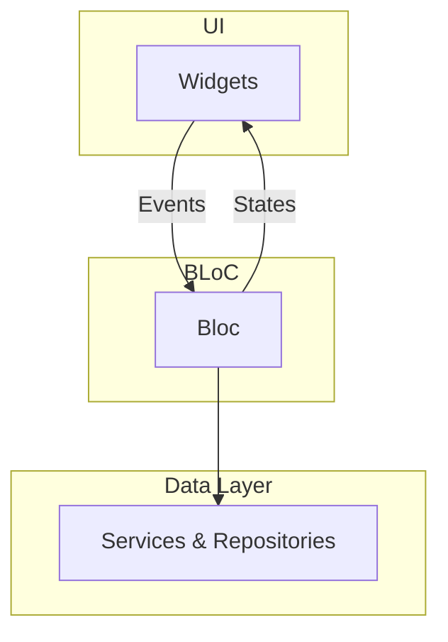

# Design Document: time_gem

## 1. Overview

`time_gem` is a Flutter application designed to help users manage their tasks and time more effectively. The app allows users to create tasks with estimated completion times and priorities. The primary feature is to integrate with Google Calendar, allowing an AI-powered agent to intelligently schedule tasks. As a fallback, the app will provide a local, on-device calendar if the user opts out of Google Calendar integration. The application will feature a user-friendly onboarding process.

This design document focuses on the initial implementation of the onboarding flow.

## 2. Detailed Analysis

### 2.1. Problem Statement

Many individuals struggle with managing their tasks and finding the time to complete them. `time_gem` aims to solve this by providing an intelligent task scheduling system that integrates with a user's calendar. The first step is a seamless onboarding experience that allows the user to connect their Google Calendar or opt for a local calendar.

### 2.2. Target Audience

The target audience for `time_gem` is students, professionals, and anyone who wants to improve their time management skills and productivity.

### 2.3. Key Features for Onboarding

*   **Onboarding:** A simple and engaging onboarding process to introduce the app and its calendar options.
*   **Google Calendar Integration:** Securely connect to the user's Google Calendar for the best experience.
*   **Local Calendar:** Provide an on-device calendar as a fallback.

## 3. Detailed Design

### 3.1. Architecture

The application will follow the **BLoC (Business Logic Component)** architectural pattern using the `flutter_bloc` package to ensure a clear separation of concerns.

*   **UI (View):** Composed of Flutter widgets, responsible for displaying data and dispatching events to the BLoC.
*   **BLoC:** Receives events, processes them, and emits new states, containing the business logic for the onboarding flow.
*   **Data Layer (Model):** Responsible for interacting with data sources, such as the Google Calendar API or the local device storage for the calendar.

### 3.2. Onboarding Flow

The onboarding process will consist of a few screens:

1.  **Welcome Screen:** A brief introduction to the app.
2.  **Calendar Integration Screen:** This screen will explain the benefits of connecting to Google Calendar. It will present two options: "Connect Google Calendar" and a secondary option like "Continue without connecting". If the user chooses the secondary option, a dialog or a brief message will explain that a local calendar will be used and that the experience is enhanced with Google Calendar integration.
3.  **Permissions Screen (for Google Calendar):** If the user chooses to connect, this screen will explain why calendar permissions are needed.

### 3.3. Calendar Integration

#### 3.3.1. Google Calendar (Recommended)

We will use the `googleapis` and `google_sign_in` packages to interact with the Google Calendar API. The app will request the `https://www.googleapis.com/auth/calendar` scope for full read/write access.

#### 3.3.2. Local Calendar (Fallback)

If the user opts out of Google Calendar integration, the app will create and manage a local calendar on the device. This will involve storing and retrieving event data from a local database (e.g., using `sqflite`). The AI scheduling features will work with this local calendar, but the user's events from other calendars will not be visible.

### 3.4. Diagrams

#### 3.4.1. Onboarding Flow

```mermaid
graph TD
    A[Welcome Screen] --> B{Connect Google Calendar?};
    B -- Yes --> C[Google Sign-In];
    C --> D{Grant Permissions?};
    D -- "Permission Granted" --> E[Main App (Google Calendar Mode)];
    D -- "Permission Denied" --> F[Show Error/Info Message];
    B -- "No / Skip" --> G["Warn about local-only usage"];
    G --> H[Main App (Local Calendar Mode)];
```

#### 3.4.2. App Architecture (BLoC)



## 4. Summary

The initial implementation of `time_gem` will focus on an onboarding flow that offers both Google Calendar integration and a local calendar fallback, using the BLoC pattern for state management. This provides flexibility for the user while establishing a solid architectural foundation.

## 5. References

*   [flutter_bloc package](https://pub.dev/packages/flutter_bloc)
*   [Google Calendar API](https://developers.google.com/calendar/api/v3/reference)
*   [googleapis package](https://pub.dev/packages/googleapis)
*   [google_sign_in package](https://pub.dev/packages/google_sign_in)
*   [sqflite package](https://pub.dev/packages/sqflite)